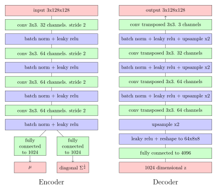
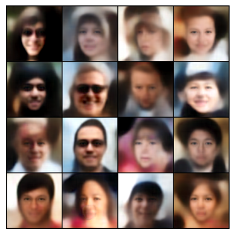
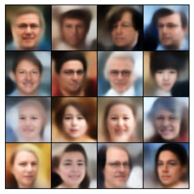
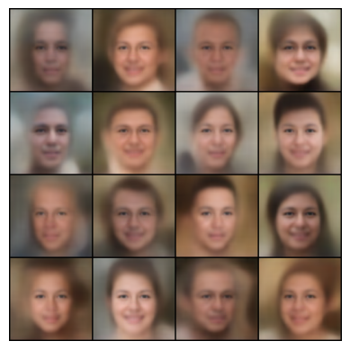

## Variational Autoencoder

A very basic variational autoencoder for 128x128 images.

The architecture looks like this:



### Training

    python3 train

(you also need a couple of libraries)

It should take around 6 hours of training depending on the GPU.

### Sampling 

    python3 train <n> <std>

where ```n``` is the number of samples and ```std``` a number between 0 and 1 that is going to multiply the latent variable during sampling. 

A small ```std``` leads to samples closer to the mean and therefore more "conservative".

### Some samples

Here are some samples with different ```std```s trained on FFHQ.


```std```=1




```std```=0.85




```std```=0.4

